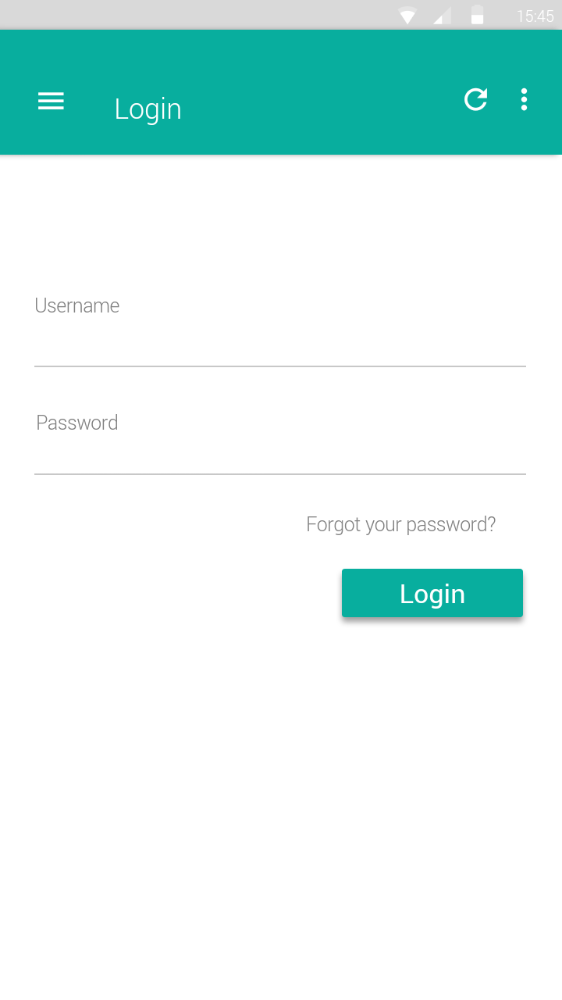
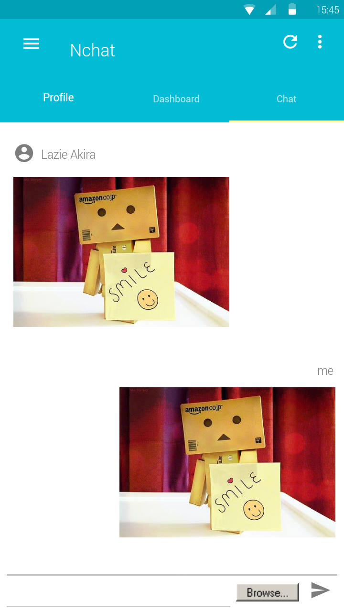
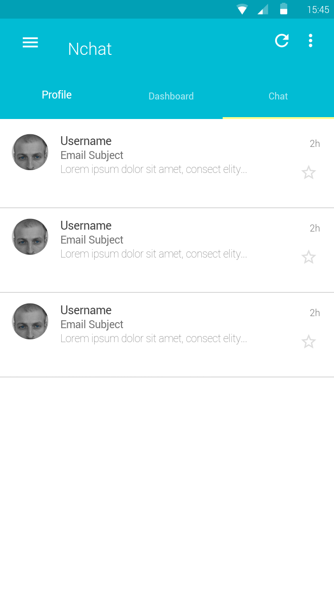
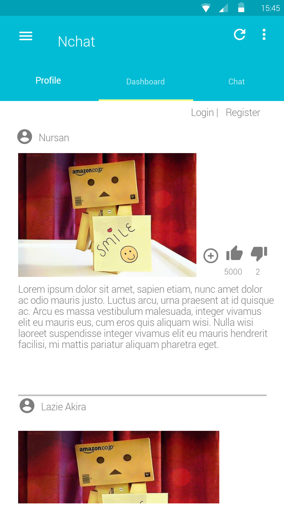
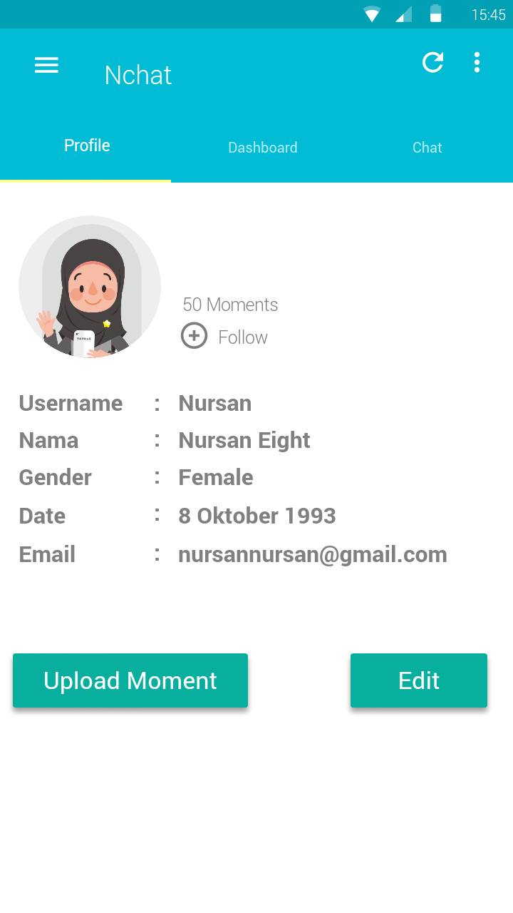
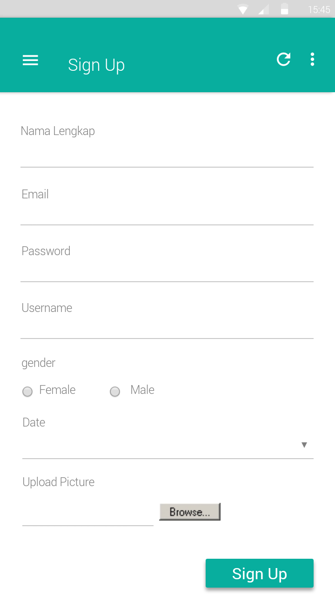
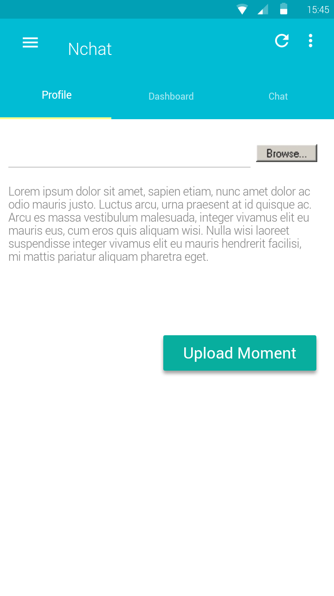

# *Skripsi*
> _urgent messages_

### features for learner / developer-
* Pengguna IM dapat melakukan login pada Instant Messaging.
* Pengguna IM – Melihat list teman
* Mengirim dan menerima pesan
* LOGIN, REGISTRATION, FORGOT PASSWORD mechanism with Firebase (with proper validation)
* Working With Firebase AUTHENTICATION, REALTIME DATABASE, STORAGE & CLOUD MESSAGING
* Update registered user profile
* Image upload, Image Cropping, Image Size Compressing (for thumb image)
* Send Friend Request to a person
* Sending/deleting Text, Image Messages & Message delivered/read/unread Mechanism (Coming Soon)

>with full UI design

#### Some Screenshots of this app

 LOGIN                                   | Chat                                        | Chat List			                    | Dashboard
:------------------------------------------:|:-------------------------------------------:|:-----------------------------------------------:|:----------------------------------------:
  |   ||

 Profile                                   | Register                                   | Upload Moment                      
:-----------------------------------------:|:--------------------------------------------:|:-----------------------------------------------:
 | |

